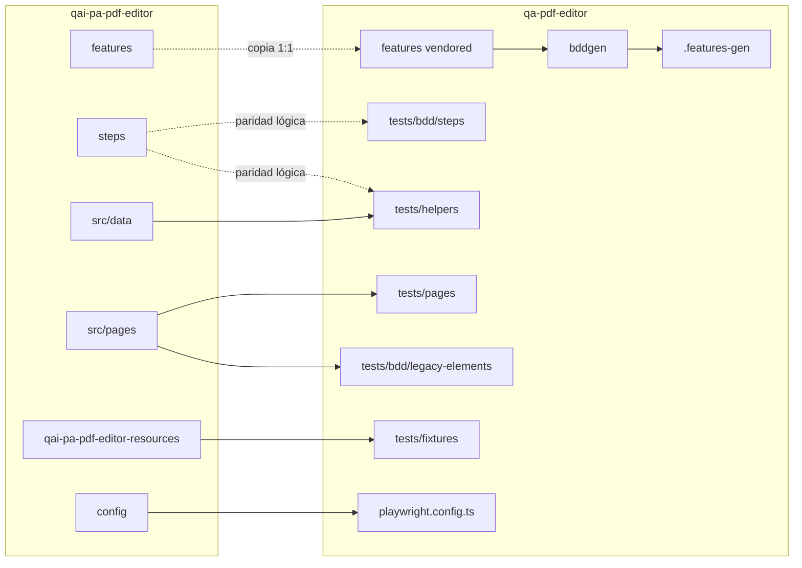

# Mapa de carpetas: qai-pa-pdf-editor (Selenium + Cucumber) → qa-pdf-editor (Playwright-BDD)

Véase también el inventario por `.feature`: [**TEST_CATALOG_BY_LEGACY_FEATURE.md**](TEST_CATALOG_BY_LEGACY_FEATURE.md).

Objetivo: entender **dónde quedó** cada pieza del repo legacy sin asumir que los nombres de carpeta son idénticos.

---

## Resumen visual

---

## `features/` (Gherkin `.feature`)

| Legacy (ruta en Cucumber) | Playwright-BDD |
|--------|----------------|
| `features/payment/FirstPayment.feature` | [`features/payment/FirstPayment.feature`](../features/payment/FirstPayment.feature) |
| `features/Dashboard.feature` | [`features/Dashboard.feature`](../features/Dashboard.feature) |
| `features/PDFhint.feature` | [`features/PDFhint.feature`](../features/PDFhint.feature) |
| `features/Recurrences.feature` | [`features/Recurrences.feature`](../features/Recurrences.feature) |
| `features/SEO.feature` | [`features/SEO.feature`](../features/SEO.feature) |
| `features/TransactionalEmails.feature` | [`features/TransactionalEmails.feature`](../features/TransactionalEmails.feature) |
| `features/Users.feature` | [`features/Users.feature`](../features/Users.feature) |
| `features/Visual.feature` | [`features/Visual.feature`](../features/Visual.feature) |
| `VisualCapture.feature` | [`features/VisualCapture.feature`](../features/VisualCapture.feature) — manual |

Playwright **ejecuta** `.feature` vía `playwright-bdd`: `defineBddConfig` en [`playwright.config.ts`](../playwright.config.ts), salida en `.features-gen/`. `npm run porting:tags` lee `features/` y, tras `bddgen`, `.features-gen/`.

---

## `steps/` (Cucumber) → `tests/bdd/steps/` + `tests/helpers/`

| Legacy | Playwright-BDD |
|--------|----------------|
| `src/steps/commonSteps.ts`, `transactionalEmailSteps.ts`, … | [`tests/bdd/steps/core.steps.ts`](../tests/bdd/steps/core.steps.ts), [`hooks.steps.ts`](../tests/bdd/steps/hooks.steps.ts), [`data.steps.ts`](../tests/bdd/steps/data.steps.ts) |
| Lógica compartida | [`tests/helpers/`](../tests/helpers/) (`navigation.ts`, `stripePayment.ts`, `crmStaging.ts`, `mailpitClient.ts`, …) |

Los pasos BDD importan helpers y POM; no hay `tests/**/*.spec.ts` ni `tests/smoke/`.

---

## `src/pages/` (POM: `*Page.ts` + `elements.json`)

| Legacy | Playwright |
|--------|------------|
| `src/pages/editor/` | [`tests/bdd/legacy-elements/editor/`](../tests/bdd/legacy-elements/editor/) + [`tests/pages/editor/`](../tests/pages/editor/) |
| `src/pages/home/` | legacy-elements + [`tests/pages/home/`](../tests/pages/home/) |
| `src/pages/login/` | legacy-elements + [`tests/pages/login/`](../tests/pages/login/) |
| `src/pages/account/` | legacy-elements + [`tests/pages/account/`](../tests/pages/account/) |
| `src/pages/contact/` | legacy-elements + [`tests/pages/contact/`](../tests/pages/contact/) |
| `src/pages/dashboard/` | legacy-elements + [`tests/pages/dashboard/`](../tests/pages/dashboard/) |
| `src/pages/components/` | [`tests/bdd/legacy-elements/components/pdfCommonPageElements.json`](../tests/bdd/legacy-elements/components/pdfCommonPageElements.json) + [`tests/pages/components/`](../tests/pages/components/) |
| `src/pages/crm/` | legacy-elements + [`tests/pages/crm/`](../tests/pages/crm/) |
| `src/pages/downloads/` | legacy-elements + [`tests/pages/downloads/`](../tests/pages/downloads/) |
| `src/pages/landing/` | legacy-elements + [`tests/pages/landing/`](../tests/pages/landing/) |

Resolución de selectores en pasos: [`tests/bdd/elementRegistry.ts`](../tests/bdd/elementRegistry.ts).

---

## `src/data/` (constantes, JSON de prueba)

| Legacy | Playwright |
|--------|------------|
| `constants.ts`, `testData.ts`, `*.json` | [`playwright/resolveBaseUrl.ts`](../playwright/resolveBaseUrl.ts), [`tests/bdd/bddTestData.ts`](../tests/bdd/bddTestData.ts), [`tests/helpers/*.ts`](../tests/helpers/), variables `PLAYWRIGHT_*` |

---

## `config/` (suites JSON, `cucumber.json`, `configuration*.json`)

| Legacy | Playwright |
|--------|------------|
| `config/suites/*.json` | Scripts npm: `test:ci-fast`, `test:ci-full`, `test:ci-visual`, `test:pdfhint-smoke` ([`package.json`](../package.json)) |
| `cucumber.json` | [`playwright.config.ts`](../playwright.config.ts) + `defineBddConfig` |
| `configuration.json` / perfiles | `BASE_URL`, `APP`, `PLAYWRIGHT_*`, `.env` |

---

## `runner/`, `results/`, `build/` (legacy)

| Legacy | Playwright |
|--------|------------|
| Runner custom / reportes Cucumber | `npm run bddgen && playwright test`, reporter HTML en `playwright-report/`, artefactos en `test-results/` |

---

## Carpetas retiradas en la migración BDD

- `tests/**/*.spec.ts` — sustituidos por escenarios Gherkin + `.features-gen/`.
- `tests/smoke/` — cobertura equivalente en `.feature` y tags `@PDFEDITOR_*`.

No hay checklist pendiente de renombrar `tests/payment` → `tests/first-payment`; la organización por dominio es ahora `features/` + `tests/bdd/`.
