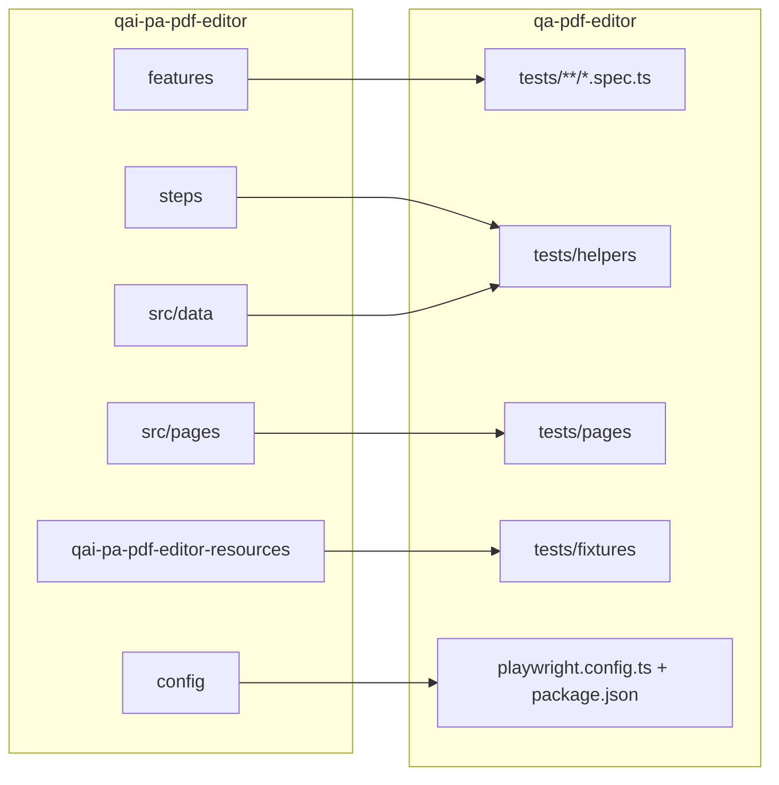

# Mapa de carpetas: qai-pa-pdf-editor (Selenium + Cucumber) → qa-pdf-editor (Playwright)

Véase también el inventario por `.feature`: [**TEST_CATALOG_BY_LEGACY_FEATURE.md**](TEST_CATALOG_BY_LEGACY_FEATURE.md).

Objetivo: entender **dónde quedó** cada pieza del repo legacy sin asumir que los nombres de carpeta son idénticos.

---

## Resumen visual

---

## `features/` (Gherkin `.feature`)

| Legacy | Playwright |
|--------|--------------|
| `features/payment/FirstPayment.feature` | [`tests/payment/`](../tests/payment/), [`tests/pdfhint/payment-smoke.spec.ts`](../tests/pdfhint/payment-smoke.spec.ts) |
| `features/Dashboard.feature` | [`tests/dashboard/`](../tests/dashboard/) |
| `features/PDFhint.feature` | [`tests/pdfhint/`](../tests/pdfhint/) |
| `features/Recurrences.feature` | [`tests/payment/recurrences-*.spec.ts`](../tests/payment/) |
| `features/SEO.feature` | [`tests/seo/`](../tests/seo/) |
| `features/TransactionalEmails.feature` | [`tests/emails/`](../tests/emails/) |
| `features/Users.feature` | [`tests/users/`](../tests/users/) |
| `features/Visual.feature` | [`tests/visual/`](../tests/visual/) |
| `VisualCapture.feature` (raíz o `features/`) | Sin spec homónimo: flujo de baseline con `npm run test:visual-update` — ver [TEST_CATALOG_BY_LEGACY_FEATURE.md](TEST_CATALOG_BY_LEGACY_FEATURE.md) |

Playwright **no** ejecuta `.feature`: la unidad es el archivo `*.spec.ts` bajo `testDir` ([`playwright.config.ts`](../playwright.config.ts) → `./tests`).

---

## `steps/` (Cucumber step definitions)

| Legacy | Playwright |
|--------|------------|
| `steps/commonSteps.ts`, `projectBaseSteps.ts`, … | [`tests/helpers/`](../tests/helpers/) — flujos reutilizables (`navigation.ts`, `stripePayment.ts`, `dashboardActions.ts`, `crmStaging.ts`, …) |

**Por qué no hay una carpeta `steps/`:** en Playwright los hooks por escenario son `test.beforeEach` / helpers importados desde los specs; renombrar `helpers` a `steps` confundiría con plugins BDD y no aporta al runner. La trazabilidad Gherkin → código sigue siendo los **tags** y [PORTING_STATUS.md](PORTING_STATUS.md).

---

## `src/pages/` (POM: `*Page.ts` + `elements.json`)

| Legacy | Playwright |
|--------|------------|
| `src/pages/editor/elements.json` + página TS | [`tests/pages/editor/elements.json`](../tests/pages/editor/elements.json) + [`tests/pages/editorSelectors.ts`](../tests/pages/editorSelectors.ts) (`editor` / `home`) |
| `src/pages/dashboard/elements.json` | [`tests/pages/dashboard/elements.json`](../tests/pages/dashboard/elements.json) + [`tests/pages/dashboardSelectors.ts`](../tests/pages/dashboardSelectors.ts) (`dashboard`) |
| Otros módulos (`landing`, `login`, …) | [`tests/pages/*Selectors.ts`](../tests/pages/) y lógica en `tests/helpers/*Actions.ts`; extracción gradual de `elements.json` como en `editor/` y `dashboard/`. |

Convención recomendada al extender el POM:

- `tests/pages/<contexto>/elements.json` — selectores estáticos (como en Selenium).
- `tests/pages/<contexto>*.ts` o `tests/helpers/*Actions.ts` — acciones y esperas que usan esos selectores.

---

## `src/data/` (constantes, JSON de prueba)

| Legacy | Playwright |
|--------|------------|
| `constants.ts`, `testData.ts`, `*.json` | Valores por defecto y resolución de URL en [`playwright/resolveBaseUrl.ts`](../playwright/resolveBaseUrl.ts), [`tests/helpers/*.ts`](../tests/helpers/) (Mailpit, CRM, Stripe, …) y variables de entorno documentadas en PORTING_STATUS |

---

## `config/` (suites JSON, `cucumber.json`, `configuration*.json`)

| Legacy | Playwright |
|--------|------------|
| `config/suites/*.json` (grupos de tags / escenarios) | Scripts npm en [`package.json`](../package.json) (`test:ci-fast`, `test:ci-full`, `test:ci-visual`, `test:smoke`, …) y rutas explícitas en [`playwright.config.ts`](../playwright.config.ts) |
| `cucumber.json` | Sustituido por la config de Playwright + convención de tags en specs |
| `configuration.json` / perfiles por app | `BASE_URL`, `APP`, `PLAYWRIGHT_*`, `.env` — ver README y PORTING_STATUS |

---

## `runner/`, `results/`, `build/` (legacy)

| Legacy | Playwright |
|--------|------------|
| Runner custom / reportes Cucumber | `npx playwright test`, reporter HTML en `playwright-report/`, artefactos en `test-results/` |

---

## Checklist opcional: renombrar carpetas bajo `tests/` (paridad de nombres con legacy)

Solo si el equipo prioriza nombres idénticos a `features/payment/` etc. Cada ítem debe completarse y verificarse con `npm run test:ci-fast` (y suites afectadas).

- [ ] Inventariar referencias: `rg "tests/payment"`, `rg "tests/dashboard"`, enlaces en `docs/`.
- [ ] Actualizar **todas** las rutas en [`package.json`](../package.json) (`scripts` que pasan rutas a `playwright test`).
- [ ] Revisar [`.github/workflows/playwright.yml`](../.github/workflows/playwright.yml) si algún job deja de usar solo scripts npm y pasa rutas literales.
- [ ] Actualizar enlaces en `docs/*.md` (PORTING_STATUS, catálogos, README).
- [ ] Renombrar carpetas con `git mv` para preservar historial.
- [ ] Ejecutar `npm run porting:tags` y `npm run test:ci-fast`; si aplica, `test:ci-full` con dispatch.

**Nota:** Hoy `tests/payment` agrupa FirstPayment **y** Recurrences; separar en `tests/first-payment` y `tests/recurrences` mejora la lectura pero exige más renombres en scripts y documentación.
